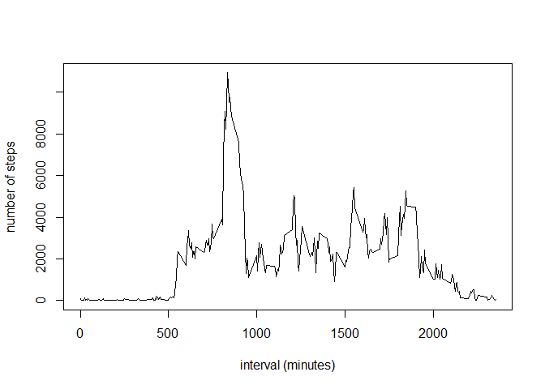

# Reproducible Research: Peer Assessment 1


## Loading and preprocessing the data
1. Load the data (i.e. read.csv())


```r
#fileUrl <- "https://d396qusza40orc.cloudfront.net/repdata%2Fdata%2Factivity.zip"
#download.file(fileUrl, "DataActivity.zip", mode="wb")
#unzip("DataActivity.zip")
activitywithNA <- read.csv("activity.csv", header=TRUE)
```

2. Process/transform the data (if necessary) into a format suitable for analysis


```r
# remove the records which does not have any data
activity <- activitywithNA[!is.na(activitywithNA$steps),]
```

## What is mean total number of steps taken per day?

1. Calculate the total number of steps taken per day


```r
# Calculate the total number of steps for each day
stepsperday <- aggregate(activity$steps, by=list(activity$date), FUN=sum, na.rm=TRUE)
# Assign column names
names(stepsperday) <- c("date", "steps")
```
  
2. Make a histogram of the total number of steps taken each day


```r
hist(stepsperday$steps, breaks=53, xlab="Number of steps", col="red",  main="Histogram of Steps taken each day")
```

 
  
3. Calculate and report the mean and median of the total number of steps taken per day


```r
# Calculate the total number of steps taken for each day
mean <- mean(stepsperday$steps)
median <- median(stepsperday$steps)
# display the result
mean  
```

```
## [1] 10766.19
```

```r
median  
```

```
## [1] 10765
```

## What is the average daily activity pattern?
1. Make a time series plot (i.e. type = "l") of the 5-minute interval (x-axis) and the average number of steps taken, averaged across all days (y-axis)


```r
stepsperinterval <- aggregate(activity$steps, by=list(activity$interval), FUN=sum)
names(stepsperinterval) <- c("interval", "steps")
plot(stepsperinterval$interval, stepsperinterval$steps, type='l', xlab="interval (minutes)", ylab="number of steps")
```

 
  
2. Which 5-minute interval, on average across all the days in the dataset, contains the maximum number of steps?
  

```r
step5minordered <- stepsperinterval[order(stepsperinterval$steps),]
step5minordered[nrow(step5minordered), "interval"]
```

```
## [1] 835
```
  
## Imputing missing values

1. Calculate and report the total number of missing values in the dataset (i.e. the total number of rows with NAs)

```r
#missing row count
nrow(activitywithNA) - nrow(activity)
```

```
## [1] 2304
```
    
2. Devise a strategy for filling in all of the missing values in the dataset. The strategy does not need to be sophisticated. For example, you could use the mean/median for that day, or the mean for that 5-minute interval, etc.  
  

```r
# Calculate mean steps for each interval
meanstepsperinterval <- aggregate(activity$steps, by=list(activity$interval), FUN=mean)
names(meanstepsperinterval) <- c("interval", "mean")

#extract records with NA value for steps
activityonlyNA <- activitywithNA[is.na(activitywithNA$steps),c("date", "interval")]

# fill NA with mean value per day
library(plyr)
activityrepNA <- join(activityonlyNA, meanstepsperinterval, by= "interval")
names(activityrepNA) <- c("date", "interval", "steps")

# rearrange the columns to match activity table
activityrepNA <- activityrepNA[,c("steps","date","interval")]
```

3. Create a new dataset that is equal to the original dataset but with the missing data filled in.


```r
# combine activity and activityrepNA(activity replaced by mean steps per day)
activitywithmean <- rbind(activity, activityrepNA)
```
4. Make a histogram of the total number of steps taken each day and Calculate and report the mean and median total number of steps taken per day. Do these values differ from the estimates from the first part of the assignment? What is the impact of imputing missing data on the estimates of the total daily number of steps?  
  

```r
# combine activity and activityrepNA(activity replaced by mean steps per day)
mean <- mean(activitywithmean$steps)
mean
```

```
## [1] 37.3826
```

```r
median <- median(activitywithmean$steps)
median
```

```
## [1] 0
```
  
## Are there differences in activity patterns between weekdays and weekends?

1. Create a new factor variable in the dataset with two levels - "weekday" and "weekend" indicating whether a given date is a weekday or weekend day.
  

```r
# Add a column to indicate the day is week day or week end.
activity$weekday <- weekdays(as.Date(activity$date)) %in% c("Monday", "Tuesday", "Wednesday", "Thursday", "Friday" ) 
```
  
2. Make a panel plot containing a time series plot (i.e. type = "l") of the 5-minute interval (x-axis) and the average number of steps taken, averaged across all weekday days or weekend days (y-axis). See the README file in the GitHub repository to see an example of what this plot should look like using simulated data.


```r
totalstepsperinterval <- aggregate(activity$steps, by=list(activity$interval, activity$weekday), FUN=sum)
names(totalstepsperinterval) <- c("interval", "weekday", "steps")

library(lattice)
```

```
## Warning: package 'lattice' was built under R version 3.1.3
```

```r
xyplot(steps ~ interval | weekday, data = totalstepsperinterval, layout = c(1,2), type = "l")
```

 
