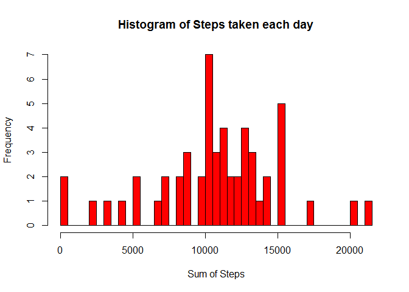
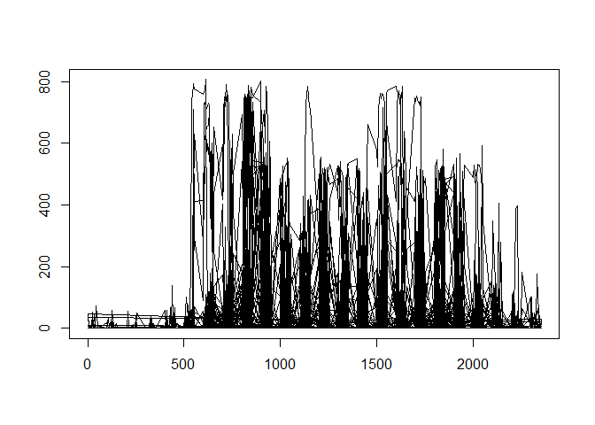

# Reproducible Research: Peer Assessment 1


## Loading and preprocessing the data
1. Load the data (i.e. read.csv())

```r
#fileUrl <- "https://d396qusza40orc.cloudfront.net/repdata%2Fdata%2Factivity.zip"
#download.file(fileUrl, "DataActivity.zip", mode="wb")
#unzip("DataActivity.zip")
activitywithNA <- read.csv("activity.csv")
```
2. Process/transform the data (if necessary) into a format suitable for analysis

```r
# remove the records which does not have any data
activity <- activitywithNA[!is.na(activitywithNA$steps),]
```

## What is mean total number of steps taken per day?

1. Calculate the total number of steps taken per day


```r
# Calculate the total number of steps for each day
stepsum <- aggregate(activity$steps, by=list(activity$date), FUN=sum, na.rm=TRUE)
# Assign column names
names(stepsum) <- c("date", "steps")
```
2. Make a histogram of the total number of steps taken each day


```r
hist(stepsum$steps, breaks=53, xlab="Sum of Steps", col="red",  main="Histogram of Steps taken each day")
```

 
3. Calculate and report the mean and median of the total number of steps taken per day


```r
# Calculate the mean of number of steps for each day
stepmean <- aggregate(activity$steps, by=list(activity$date), FUN=mean, na.rm=TRUE)
names(stepmean) <- c("date", "mean")
# Calculate the median of number of steps for each day
stepmedian <- aggregate(activity$steps, by=list(activity$date), FUN=median, na.rm=TRUE)
names(stepmedian) <- c("date", "median")
# Combine mean and median datasets
stepmeanandmedian <- cbind(stepmean,stepmedian$median)
# Update the column names
names(stepmeanandmedian) <- c("date", "mean", "median")
# display the result
stepmeanandmedian
```

```
##          date       mean median
## 1  2012-10-02  0.4375000      0
## 2  2012-10-03 39.4166667      0
## 3  2012-10-04 42.0694444      0
## 4  2012-10-05 46.1597222      0
## 5  2012-10-06 53.5416667      0
## 6  2012-10-07 38.2465278      0
## 7  2012-10-09 44.4826389      0
## 8  2012-10-10 34.3750000      0
## 9  2012-10-11 35.7777778      0
## 10 2012-10-12 60.3541667      0
## 11 2012-10-13 43.1458333      0
## 12 2012-10-14 52.4236111      0
## 13 2012-10-15 35.2048611      0
## 14 2012-10-16 52.3750000      0
## 15 2012-10-17 46.7083333      0
## 16 2012-10-18 34.9166667      0
## 17 2012-10-19 41.0729167      0
## 18 2012-10-20 36.0937500      0
## 19 2012-10-21 30.6284722      0
## 20 2012-10-22 46.7361111      0
## 21 2012-10-23 30.9652778      0
## 22 2012-10-24 29.0104167      0
## 23 2012-10-25  8.6527778      0
## 24 2012-10-26 23.5347222      0
## 25 2012-10-27 35.1354167      0
## 26 2012-10-28 39.7847222      0
## 27 2012-10-29 17.4236111      0
## 28 2012-10-30 34.0937500      0
## 29 2012-10-31 53.5208333      0
## 30 2012-11-02 36.8055556      0
## 31 2012-11-03 36.7048611      0
## 32 2012-11-05 36.2465278      0
## 33 2012-11-06 28.9375000      0
## 34 2012-11-07 44.7326389      0
## 35 2012-11-08 11.1770833      0
## 36 2012-11-11 43.7777778      0
## 37 2012-11-12 37.3784722      0
## 38 2012-11-13 25.4722222      0
## 39 2012-11-15  0.1423611      0
## 40 2012-11-16 18.8923611      0
## 41 2012-11-17 49.7881944      0
## 42 2012-11-18 52.4652778      0
## 43 2012-11-19 30.6979167      0
## 44 2012-11-20 15.5277778      0
## 45 2012-11-21 44.3993056      0
## 46 2012-11-22 70.9270833      0
## 47 2012-11-23 73.5902778      0
## 48 2012-11-24 50.2708333      0
## 49 2012-11-25 41.0902778      0
## 50 2012-11-26 38.7569444      0
## 51 2012-11-27 47.3819444      0
## 52 2012-11-28 35.3576389      0
## 53 2012-11-29 24.4687500      0
```

## What is the average daily activity pattern?
1. Make a time series plot (i.e. type = "l") of the 5-minute interval (x-axis) and the average number of steps taken, averaged across all days (y-axis)

```r
plot(activity$interval,activity$steps, type='l', xlab="", ylab="")
```

 
2. Which 5-minute interval, on average across all the days in the dataset, contains the maximum number of steps?


```r
step5min <- aggregate(activity$steps, by=list(activity$interval), FUN=sum, na.rm=TRUE)
names(step5min) <- c("interval",  "steps")
step5minordered <- step5min[order(step5min$steps),]
step5minordered[nrow(step5minordered), "interval"]
```

```
## [1] 835
```

## Imputing missing values

1. Calculate and report the total number of missing values in the dataset (i.e. the total number of rows with NAs)

```r
#missing row count
nrow(activitywithNA) - nrow(activity)
```

```
## [1] 2304
```

## Are there differences in activity patterns between weekdays and weekends?
